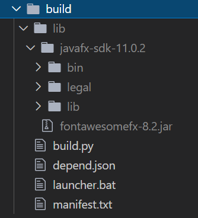

# secur3dit

secur3dit is a free and open-source tool that helps you edit images and encrypt files.


## Tech Stack

The application is primarily written in Java. The source code can be built using Python3.

## Building

The project has two dependencies which need to be placed under `build/lib`

1. fontawesomefx-8.2.jar 
2. javafx-sdk-11.0.2

The tree view of the build directory should look like the following. 



Once you have this ready, fire up your command prompt and `cd` into the root directory of this project. 

```cmd
cd build
py build.py
```

You can find the produced files under `output` directory. All you have to do is run the launcher.bat file! 

## Authors

1. [Naman Nihal](https://github.com/namannihal) 
2. [Priyanshul Govil](https://github.com/priyanshul-govil) 
3. [Vivek Nathani](https://github.com/viveknathani) 

## Contributing

If you are interested in contributing to our organisation, we recommend reading our [standard guidelines.](https://github.com/secur3dit/standard)

## License

[MIT](./LICENSE.md)
